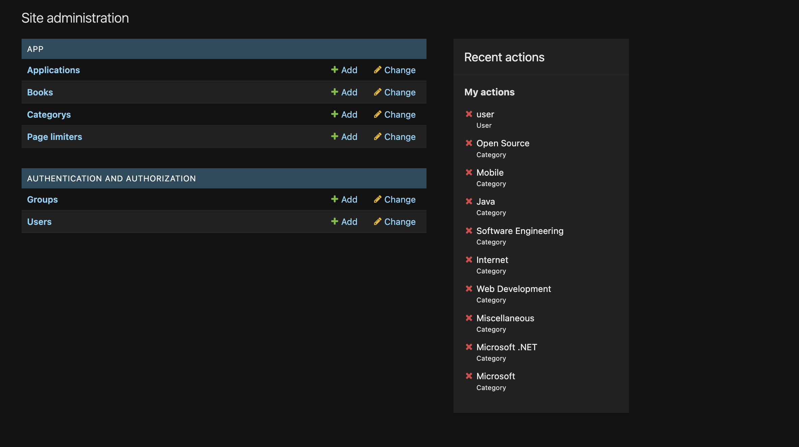

# BookShopDjango

**Задача:** Разработать бэкенд для тестового сайта на языке программирования Python, используя фреймворк Django, согласно заданным параметрам. Дополнительно реализовать вывод на фронт часть. Дополнительно упаковать проект в докер контейнер.

В результате выполнения задачи был разработан бэкенда для условного магазина книг. Дополнительно был добавлен вывод на фронтенд без подключения стилизации. Заключительным этапом разрабоатнный проект был упакован в докер контейнер. Контейнер приложен в разделе Release на ГИТ.

## 0. Общие положения
На разработанном сайте реализовано:
- Админ панель. В настройках админ панели добавлена возможноть корректировать исходное кол-во элементов на странице, а так же e-mail получения сообщений. 
- Регистрация и Авторизация пользователей на сайте
- Добавлен дополнительный скрипт, позволяющий выполнять парсинг элементов (книг) с файла json заданной структуры 
- Добавлены категории книг и возможность их настройки. Так же на сайте возможно отсортировать книги по заданной категории
- Добавлена страница детального просмотра элемента(книги)
- Добавлена форма обратной связи. Отчет по форме автоматически формируется в админ панели
- Добавлен поиск книг по названию и автору
- Добавлена возможность пользователю выбирать кол-во книг, отображаемых на странице.

## 1. Настройки приложения

В админ панели в специальном разделе "Page Limiters" администратор может настроить число выводимых объектов на странице, а так же Email адрес получателя сообщения с формы обратной связи.Как представлено на рисунке 1.

Рисунок 1. Раздел "Page Limiters"

Дополнительно добавлена защита от добавления большего числа параметров в данную настройку. По умолчанию администратор может добавить только один параметр.

Так же администратор способен выбрать источник получения данных в формате json. Для этого в командной строке в корневой папке проекта необходимо ввести следующую команду:

_**python3 loadbooks.py [OPTION]**_

где параметр [OPTION] - это источник данных в формате json. Если параметр не задан пользователем, то по умолчанию используется следующий адрес: 'https://gitlab.grokhotov.ru/hr/yii-test-vacancy/-/raw/master/books.json'

## 2. Админ панель

В админ панели предусмотрено несколько форм. Форма Applications сохраняет и выводит сообщения, полученные из формы обратной связи. Формы Books & Categorys предназначены для добавления и редактирования книг (в том числе загрузка изображений) и категорий (без возможности настройки вложенных категорий) соответствено. Форма Users необходима для просмотра зарегестрированных пользователей.

Рисунок 2. Админ Панель

## 3. Форма авторизации и регистрации

На сайте предусмотрена форма авторизации (рис. 3) и регистрации пользователей (рис. 4). Инофрмация о зарегестрированных пользователях сохраняется в базу данных

Рисунок 3. Форма авторизации

Рисунок 4. Форма регистрации

Для входа в админ панель необходимо использовать комбинацию логин:пароль - admin:admin

## 4. Форма обратной связи

